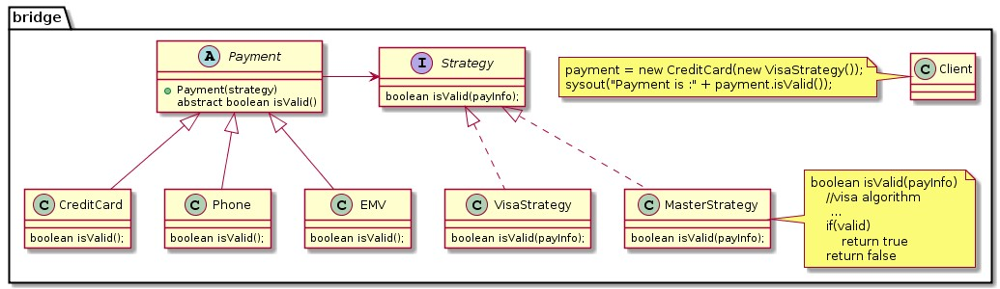

- It's a Structural Pattern (**HOW DO YOU BUILD/STRUCTURE COMPONENTS??**). 
- Decoupling Abstraction from it's Implementation. 
- Intent is to **completely decouple the Abstraction from the Implementation.**
 

