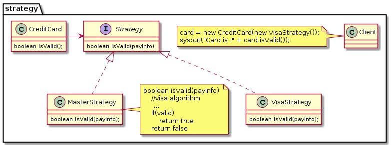

- It's a Behavioural Pattern (**HOW DO YOU WANT YOUR COMPONENTS TO BEHAVE??**). 
- Context tied to the Strategy: The context Class (possibly Abstract but not really an interface! as u wish to encapsulate out a specific behavior and not the entire implementation) would know/contain the strategy interface reference and the implementation to invoke the strategy behavior on it.
- Intent is ability to **swap behavior at runtime**

